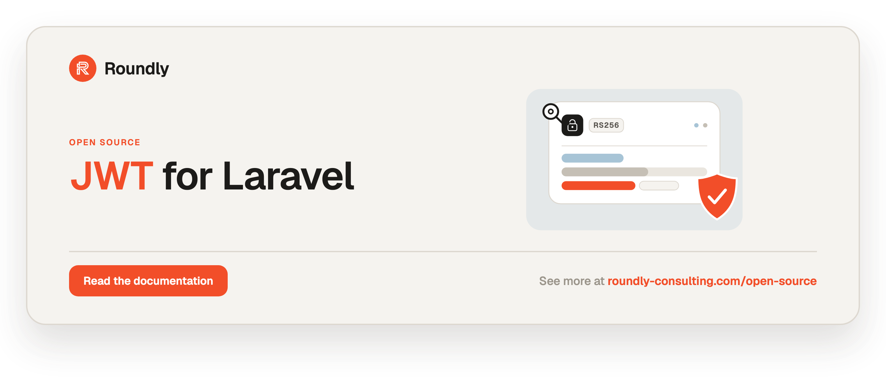

<p align="center">
  <a href="https://roundly-consulting.com/open-source">
    
  </a>
</p>

# JWT for Laravel

Native **RS256 user tokens** and **HS256 service tokens**, guard drivers, a jti denylist and
claim-based authorization for Laravel — with **zero third-party crypto**. The entire JOSE core
(compact JWS encode/verify, base64url, key handling) is implemented on top of PHP's own
`ext-openssl`/`hash_hmac`; there is no `firebase/php-jwt` or any other runtime JWT dependency.

Two token families, strictly separated by algorithm and purpose:

- **User tokens — RS256 (asymmetric).** Minted by issuer apps holding the private key; verified
  offline everywhere with only the public PEM.
- **Service tokens — HS256 (shared secret).** Machine-to-machine only.

Security is the point: single-algorithm pinning (so `alg:none` and RS256↔HS256 confusion are
structurally impossible), constant-time HMAC comparison, PEM-as-HMAC rejection, RSA key-type and
key-size (≥ 2048-bit) validation, per-call clock leeway with no global state, and rejection of the
`crit` header.

## Requirements

- PHP 8.4+
- Laravel 12 or 13
- `ext-openssl`, `ext-json`

## Installation

```bash
composer require roundly-consulting/jwt-for-laravel
```

Publish the config file:

```bash
php artisan vendor:publish --tag="jwt-config"
```

On an **issuer** app (one that mints user tokens), generate an RSA keypair:

```bash
php artisan jwt:generate-keys
```

On a **verify-only** app, copy the issuer's public key to the path in `JWT_PUBLIC_KEY_PATH`
(default `storage/jwt-public.pem`) — no private key is needed.

## Configuration

The published `config/jwt.php` is fully env-driven and works with zero host config for
verification once the keys/secret are set. Every key and its backing env var:

| Config key | Env var | Default | Purpose |
|---|---|---|---|
| `private_key_path` | `JWT_PRIVATE_KEY_PATH` | `null` | RSA private key path (issuers only) |
| `public_key_path` | `JWT_PUBLIC_KEY_PATH` | `storage_path('jwt-public.pem')` | RSA public key path |
| `algo` | `JWT_ALGO` | `RS256` | User-token algorithm |
| `issuer` | `JWT_ISSUER` | `null` | Pinned `iss` |
| `audience` | `JWT_AUDIENCE` | `null` | Pinned `aud` |
| `ttl` | `JWT_TTL` | `900` | Access-token lifetime (seconds) |
| `challenge_ttl` | `JWT_CHALLENGE_TTL` | `300` | `2fa_pending` lifetime |
| `verify_ttl` | `JWT_VERIFY_TTL` | `3600` | `email_verify` lifetime |
| `leeway` | `JWT_LEEWAY` | `10` | Clock-skew tolerance (seconds) |
| `kid` | `JWT_KID` | `null` | Emitted `kid` header when set |
| `guard.scope` | — | `access` | Scope required to authenticate the `jwt` guard |
| `guard.identity` | — | `TokenUser::class` | Claims-mode identity class |
| `guard.token_version` | — | `null` | `callable|invokable-class|null` returning the user's current version |
| `guard.check_denylist` | `JWT_CHECK_DENYLIST` | `true` | Enforce the jti denylist |
| `denylist.store` | `JWT_DENYLIST_STORE` | `redis` | Cache store backing the denylist |
| `denylist.prefix` | `JWT_DENYLIST_PREFIX` | `jwt:denylist:` | Denylist cache-key prefix |
| `service.secret` | `SERVICE_JWT_SECRET` | `null` | HS256 shared secret |
| `service.issuer` | `JWT_SERVICE_ISSUER` | `env('APP_SERVICE')` | This service's name (token `iss`) |
| `service.audience` | `JWT_SERVICE_AUDIENCE` | `null` | Default service-token `aud` |
| `service.ttl` | `SERVICE_JWT_TTL` | `60` | Service-token lifetime (seconds) |
| `service.issuers` | `JWT_SERVICE_ISSUERS` | `[]` (any) | Comma-separated issuer allow-list |
| `authorize_from_claims` | `JWT_AUTHORIZE_FROM_CLAIMS` | `false` | Enable the claim-based `Gate::before` |

## Usage

### Mint a user access token

Resolve the `UserTokenIssuer` contract (bound to `NativeUserTokenIssuer`):

```php
use RoundlyConsulting\Jwt\UserTokens\Contracts\UserTokenIssuer;

$issued = app(UserTokenIssuer::class)->mintAccessToken(
    subject: (string) $user->id,
    email: $user->email,
    emailVerified: $user->hasVerifiedEmail(),
    tokenVersion: $user->token_version,
    permissions: ['posts.view', 'posts.edit'],
);

$issued->token;      // the compact JWS string
$issued->expiresAt;  // CarbonImmutable
$issued->jti;        // the token id (store it to denylist later)
```

For challenge or custom scopes use the generic `mint()`:

```php
$issuer->mint($subject, '2fa_pending', ttl: 300);
$issuer->mint($subject, 'email_verify', ttl: 3600, extraClaims: ['email' => $email]);
```

### Verify a token offline

```php
use RoundlyConsulting\Jwt\UserTokens\Contracts\UserTokenVerifier;

$claims = app(UserTokenVerifier::class)->verify($jwt); // RS256 + iss/aud pinned
$claims->string('sub');
$claims->list('permissions');
```

Invalid tokens throw a `RoundlyConsulting\Jwt\Jose\Exceptions\JwtException` subclass
(`InvalidSignature`, `TokenExpired`, `AlgorithmMismatch`, `ClaimMismatch`, …).

### Wire the guards

Declare the guards in `config/auth.php` — the package provides the drivers:

```php
'guards' => [
    // Claims mode: build a TokenUser straight from the token (no DB).
    'api' => ['driver' => 'jwt'],

    // Provider mode: resolve a real Eloquent user via `sub`.
    // 'api' => ['driver' => 'jwt', 'provider' => 'users'],

    'service' => ['driver' => 'service-jwt'],
],
```

Then protect routes as usual:

```php
Route::middleware('auth:api')->get('/me', fn () => request()->user());
Route::middleware('auth:service')->post('/internal/sync', SyncController::class);
```

In provider mode, set `guard.token_version` so a bumped version invalidates old tokens:

```php
'guard' => [
    'token_version' => fn (\App\Models\User $user): int => $user->token_version,
],
```

### Issue and send a service token

```php
use RoundlyConsulting\Jwt\ServiceTokens\Contracts\ServiceTokenIssuer;
use RoundlyConsulting\Jwt\ServiceTokens\ServiceCaller;

$token = app(ServiceTokenIssuer::class)->issue('target-service')->token;

// Or attach one to an outbound internal HTTP call:
app(ServiceCaller::class)->request('target-service')
    ->post('https://target.internal/endpoint', [...]);
```

A missing `SERVICE_JWT_SECRET` raises `ServiceAuthMisconfigured` (a 500), never a silent 401.

### Log a user out (denylist a jti)

```php
use RoundlyConsulting\Jwt\Denylist\Contracts\Denylist;

app(Denylist::class)->deny($issued->jti, $issued->expiresAt);
```

The entry auto-evicts when the token would have expired. The `jwt` guard rejects denylisted
tokens while `guard.check_denylist` is true.

### Claim-based authorization

Set `authorize_from_claims` to `true` and abilities listed in the token's `permissions` claim are
granted through Laravel's Gate:

```php
if ($request->user()->can('posts.edit')) {
    // ...
}
```

The hook returns `null` (not `false`) on a miss, so your own gates and policies still run.

### `jwt:generate-keys`

```bash
php artisan jwt:generate-keys          # writes both PEMs; refuses to overwrite
php artisan jwt:generate-keys --force  # overwrite existing keys
```

Generates a 2048-bit RSA keypair; the private key is written with `0600` permissions.

## Firebase-free parity

The package is verification-compatible with the tokens `firebase/php-jwt` produces, proven by
committed static fixtures and the RFC 7515 example vectors under `tests/fixtures/` — **without
`firebase/php-jwt` ever appearing in `composer.json`** (an architecture test forbids importing
`Firebase\` in `src/` and `tests/`). The fixtures are a test aid, not a runtime dependency.

## Testing

```bash
composer test
```

## Changelog & Contributing

Please see the commit history for changes. Issues and pull requests are welcome.

## License

The MIT License (MIT). See [LICENSE.md](LICENSE.md). Maintained by roundly-consulting.
